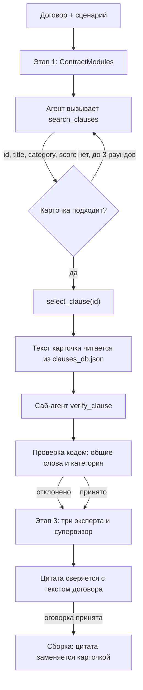

# LegalTech AI: модульный конструктор договоров

Прототип проверки договора под конкретный конфликтный сценарий. На входе текст договора и ситуация, например «заказчик не подписывает акт и не платит финальный транш». На выходе:

1. Договор, разложенный на пять модулей: предмет, оплата, сроки и приёмка, ответственность, споры.
2. Эталонная оговорка из локальной базы, если саб-агент подтвердил, что она закрывает сценарий.
3. Оценка риска 1–10, категория (`Financial`, `Legal`, `Operational`) и дословная цитата слабого места.
4. Собранный текст договора, где цитата заменена оговоркой из базы.

Своих формулировок модель в договор не вставляет. Если подходящей карточки нет, сборка не выполняется.

## Запуск

Python 3.13, [uv](https://docs.astral.sh/uv/).

```bash
uv sync
uv run python main.py --mock          # без ключа и без сети
uv run python -m unittest discover -s tests
```

Для живой модели скопируй `.env.example` в `.env` (если `.env` ещё нет) и впиши ключ:

```
LLM_MODEL="gpt-4o-mini"
OPENAI_API_KEY="sk-..."
```

Для OpenRouter модель указывается с префиксом: `LLM_MODEL="openrouter/openai/gpt-4o-mini"` и `OPENROUTER_API_KEY`. Эмбеддинги `text-embedding-3-small` подбираются под провайдера автоматически. Для других чат-моделей нужно задать `EMBEDDING_MODEL` явно.

```bash
uv run python main.py                                   # три договора из data/
uv run python main.py data/contract_1.txt --scenario "Заказчик задержал оплату на 40 дней"
uv run python api.py                                    # POST /api/v1/analyze {contract_text, scenario}
```

Без `--scenario` берётся сценарий кейса из ТЗ (`core/scenarios.py`). Для файла не из `data/` сценарий обязателен. Отчёты пишутся в `reports/<имя файла>.md`.

В режиме `--mock` вместо модели работают детерминированные правила из `core/llm.py`, а поиск идёт по хеш-векторам. База, проверки и сборка те же, что и в живом режиме. Мок нужен для воспроизводимости и тестов, качество модели он не показывает.

## Схема вызовов



**Этап 1.** Модель режет договор на модули `ContractModules`. Каждая фраза модуля должна находиться в исходном тексте. Если модель пересказала или дописала норму, запрос повторяется. Отсутствующий раздел заполняется строкой «В договоре не указано.»

**Этап 2.** Модель не видит текстов оговорок. `search_clauses(query, applies_to)` ищет по векторному индексу (Qdrant in-memory) с фильтром по типу договора и возвращает только метаданные. `select_clause(id)` принимает id из уже показанной выдачи, текст подставляется из JSON. Дальше карточку проверяет отдельный вызов `verify_clause`, которому передают договор, сценарий и оговорку. Положительный вердикт засчитывается, если у оговорки и сценария есть общие основы слов и категория карточки совпадает с классом риска сценария. Иначе оговорка отклоняется.

**Этап 3.** Финансист, юрист и операционист параллельно ищут слабое место, супервизор сводит их мнения в `RiskReport`. Цитата обязана быть подстрокой договора: выдуманную цитату модель получает обратно с требованием исправить. Если оговорка из этапа 2 принята, поле `suggested_fix` заменяется её текстом.

**Сборка.** Цитата заменяется оговоркой. Фразы, которые противоречат вставленному тексту (например, «пени не предусмотрены» рядом с новой пеней), удаляются. У фразы про финальный транш снимается только условие «после подписания акта»: сумма и срок выплаты остаются.

Все данные клиента попадают в промпт внутри маркеров со случайным nonce, и промпты запрещают исполнять команды из этих блоков.

## Пример лога стресс-теста

Договор на разработку ПО, живой прогон `uv run python main.py data/contract_1.txt`. В шапке отчёта написано, мок это или имя модели. Полный отчёт: `reports/contract_1.md`.

```
Уязвимая цитата  «Цикл внесения правок Заказчиком не ограничен. Акт подписывается только
                 после полного устранения всех замечаний Заказчика по его усмотрению.»
Сценарий         Заказчик бесконечно возвращает результат на правки, не подписывает акт
                 и задерживает финальный транш.
Оценка           9/10, Financial
Карточка         SAAS-01, принята саб-агентом
Новая редакция   «Если Заказчик в течение 10 рабочих дней с даты получения результата
                 не подписывает Акт приемки-передачи и не направляет мотивированный
                 письменный отказ, работы считаются принятыми, а финальный транш
                 в согласованном размере выплачивается в течение 5 рабочих дней после
                 этой даты. Количество итераций правок ограничено тремя.»
В п. 2 осталось  «Финальный транш 70% выплачивается строго в течение 5 дней.»
```

## Структура

```
main.py              консольный запуск, отчёты в reports/
api.py               FastAPI, POST /api/v1/analyze
schemas.py           Pydantic-модели входа, модулей и отчёта
core/step1_decompose.py   этап 1
core/step2_rag.py         инструменты поиска и саб-агент проверки
core/step3_stress.py      эксперты и супервизор
core/assemble.py          сборка итогового текста
data/clauses_db.json      15 эталонных оговорок
data/contract_*.txt       три синтетических договора из ТЗ
```
