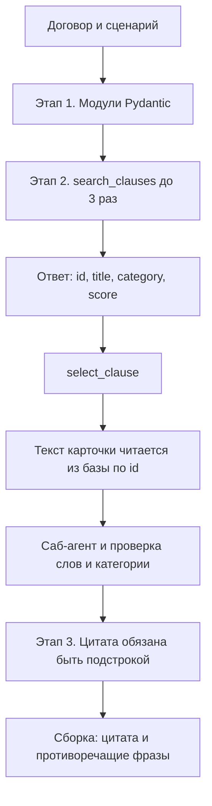

# LegalTech AI: модульный конструктор договоров

Консольный пайплайн: декомпозиция договора, поиск эталонной оговорки через tool calling, проверка саб-агентом и стресс-тест. В собранный текст попадает только формулировка из базы.

Ключ провайдера лежит в `.env` и в git не входит. Если папка уже уходила ревьюеру, ключ нужно отозвать и выпустить новый. В архив `.env` не класть.

## Запуск

Нужен Python 3.13 и [uv](https://docs.astral.sh/uv/).

```bash
uv sync
cp .env.example .env
python main.py --mock
```

`--mock` не ходит в сеть. Живая модель: в `.env` задайте `LLM_MODEL` и ключ, затем `python main.py`. API только на localhost, без аутентификации: `python api.py`, `POST /api/v1/analyze`. Пустой ввод — 422, сбой модели — 502 без текста исключения. Тело больше 256 КБ отклоняется и по `Content-Length`, и по фактически прочитанным байтам.

## Как устроены вызовы



Модель на этапе 2 не получает текст оговорки. `search_clauses` фильтрует базу по типу договора и отдаёт метаданные. Пустой фильтр не снимается: модель может вызвать поиск ещё раз. `select_clause` принимает только id из этой выдачи. Текст подставляется из JSON базы.

Саб-агент отвечает, решает ли карточка сценарий. Битый JSON повторяется до трёх раз. Даже при `is_relevant=true` вставка не состоится, если у оговорки и сценария меньше двух общих основ или категория карточки не стыкуется со сценарием (`sla` не закрывает спор о пене). Черновик модели в договор не пишется.

Супервизор отдаёт `vulnerable_quote`. Она должна быть подстрокой договора, не длиннее 1500 символов и не больше 70% текста. Плейсхолдер `<СРОК>` в договоре не портится: данные обрамляются nonce-маркером, а не заменой скобок. Если цитата встречается дважды, заменяется вхождение в разделе, который ближе к сценарию.

После вставки снимаются фразы, которые спорят с оговоркой. В кейсе поставки исчезает «пени не предусмотрены», в кейсе разработки — оплата транша только после подписания акта.

В базе 15 оговорок.

## Пример лога

Прогон `python main.py --mock`, договор на разработку ПО.

Сценарий: заказчик бесконечно возвращает результат на правки, не подписывает акт и задерживает финальный транш.

Уязвимая цитата: «Заказчик тестирует ПО и вправе возвращать его на доработку. Цикл внесения правок Заказчиком не ограничен. Акт подписывается только после полного устранения всех замечаний Заказчика по его усмотрению.»

Оценка: 9/10, Operational. Карточка `SAAS-01`.

Защита из базы: молчаливая приёмка за 10 рабочих дней, немедленный финальный транш, не больше трёх итераций. Фраза про выплату транша строго после акта из порядка расчётов убрана.

Полный текст — в `reports/contract_1.md`.
