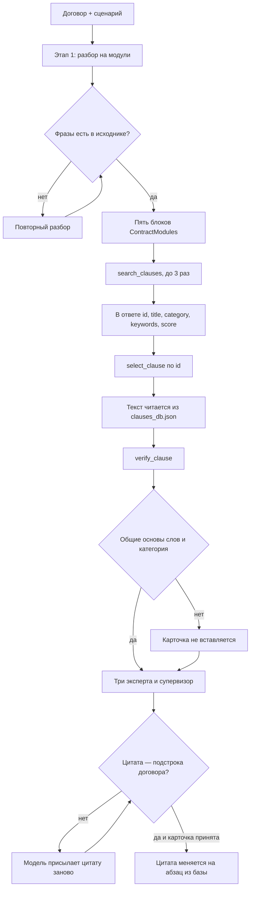

# LegalTech AI: модульный конструктор договоров

Прототип проверки договора под конкретный конфликтный сценарий. На входе текст договора и ситуация, например «заказчик не подписывает акт и не платит финальный транш». На выходе:

1. Договор, разложенный на пять модулей: предмет, оплата, сроки и приёмка, ответственность, споры.
2. Эталонная оговорка из локальной базы, если саб-агент подтвердил, что она закрывает сценарий.
3. Оценка риска 1–10, категория (`Financial`, `Legal`, `Operational`) и дословная цитата слабого места.
4. Собранный текст договора, где цитата заменена оговоркой из базы.

## Быстрый старт

Python 3.13, [uv](https://docs.astral.sh/uv/).

```bash
uv sync
uv run python main.py --mock          # без ключа и без сети
uv run python -m unittest discover -s tests
```

`--mock` не ходит в сеть: ответы собираются правилами из `core/llm.py`, поиск идёт по хеш-векторам. База, проверки и сборка те же. Качество модели этот режим не показывает. В шапке `reports/*.md` написано `Режим: mock` или `Режим: модель <имя из LLM_MODEL>`.

Живой прогон: если `.env` ещё нет, скопируйте пример и впишите ключ. Если файл уже есть, не затирайте его копированием.

```bash
cp .env.example .env
```

OpenAI:

```
LLM_MODEL="gpt-4o-mini"
OPENAI_API_KEY="sk-..."
```

OpenRouter, модель с префиксом провайдера:

```
LLM_MODEL="openrouter/openai/gpt-4o-mini"
OPENROUTER_API_KEY="sk-or-..."
```

Эмбеддинги `text-embedding-3-small` подбираются под OpenAI и OpenRouter сами. Для другой чат-модели задайте `EMBEDDING_MODEL`.

```bash
uv run python main.py
uv run python main.py data/contract_1.txt --scenario "Заказчик задержал оплату на 40 дней"
uv run python api.py
```

Без `--scenario` берётся сценарий кейса из `core/scenarios.py`. Для файла не из `data/` сценарий обязателен. Отчёты: `reports/<имя файла>.md`.

## Как устроены три этапа



**1. Разбор.** Договор режется на предмет, оплату, сроки и приёмку, ответственность, споры. Каждая фраза модуля должна находиться в исходном тексте. Если модель пересказала абзац, запрос повторяется. Пустой раздел заполняется строкой «В договоре не указано.»

**2. Поиск без текста карточки.** Модель не видит формулировок из базы.

`search_clauses(query, applies_to)` ищет в Qdrant in-memory. `applies_to`: `SaaS`, `supply` или `NDA`. В ответе только метаданные. Текста оговорки там нет. Пустой фильтр по типу договора не снимается. Если запрос модели ничего не набрал выше порога, тот же фильтр повторяется по тексту сценария. Поисков не больше трёх.

`select_clause(clause_id)` принимает id, который уже был в выдаче этого прогона. Абзац подставляется из JSON.

Дальше отдельный вызов `verify_clause`: договор, сценарий и карточка. Оговорка подходит, если она закрывает дыру, в том числе когда говорит противоположное плохому условию. Положительный вердикт засчитывается только если у карточки и сценария есть общие основы слов и категория карточки стыкуется со сценарием. Иначе карточка блокируется, даже если модель сказала «да».

**3. Стресс-тест и сборка.** Финансист, юрист и операционист смотрят договор параллельно. Супервизор собирает `RiskReport`: оценка 1–10, категория `Financial`, `Legal` или `Operational`, дословная цитата. Цитата обязана быть подстрокой договора, не длиннее 1500 символов и не больше 70% текста. Выдуманную цитату модель получает обратно.

Если карточка принята, цитата меняется на её текст. Фразы, которые с этим текстом спорят, снимаются. «Пени не предусмотрены» рядом с новой пеней уходит целиком. У оплаты транша снимается только условие «после подписания акта»: сумма и срок остаются.

## Три кейса из ТЗ

Сценарии лежат в `core/scenarios.py`. Цифры ниже — из `reports/` после прогона.

| Договор                         | Сценарий                                                                | Риск              | Карточка                                                                                                                          |
| ------------------------------- | ----------------------------------------------------------------------- | ----------------- | --------------------------------------------------------------------------------------------------------------------------------- |
| Разработка ПО, `contract_1.txt` | Бесконечные правки, акт не подписывают, финальный транш висит           | 9/10, Operational | `SAAS-01`: 10 рабочих дней считаются с даты получения результата, молчание значит приёмку, итераций не больше трёх                |
| Поставка, `contract_2.txt`      | Жёсткий штраф за просрочку поставки и ни одной пени за просрочку оплаты | 9/10, Financial   | `SUPPLY-01`: симметричная пеня 0,1% в день и потолок 10% цены договора                                                            |
| NDA, `contract_3.txt`           | Штраф 10 млн за разглашение без доказывания убытков                     | 9/10, Legal       | `NDA-01`: только сведения с грифом, потолок неустойки, снижение по ст. 333 ГК. Убытки для взыскания неустойки доказывать не нужно |

## Лог стресс-теста

Кейс 1, `reports/contract_1.md`.

```
Сценарий         Заказчик бесконечно возвращает результат на правки, не подписывает акт
                 и задерживает финальный транш.
Уязвимая цитата  «Заказчик тестирует ПО и вправе возвращать его на доработку. Цикл внесения
                 правок Заказчиком не ограничен. Акт подписывается только после полного
                 устранения всех замечаний Заказчика по его усмотрению.»
Оценка           9/10, Operational
Карточка         SAAS-01, саб-агент принял
Новая редакция   «Если Заказчик в течение 10 рабочих дней с даты получения результата
                 не подписывает Акт приемки-передачи и не направляет мотивированный
                 письменный отказ, работы считаются принятыми, а финальный транш
                 в согласованном размере выплачивается в течение 5 рабочих дней после
                 этой даты. Количество итераций правок ограничено тремя.»
В п. 2 осталось  «Финальный транш 70% выплачивается строго в течение 5 дней.»
```

## Что не даёт промпту управлять пайплайном

Текст клиента обрамляется случайным маркером. Закрывающий тег другой, команды внутри блока промпт велит не исполнять.

```
<<<contract-a9f18c4e0123abcd>>>
... текст договора ...
<<<END-contract-a9f18c4e0123abcd>>>
```

Вставка абзаца не зависит от оценки 1–10. Её решает принятая карточка из базы.

## Структура

```
main.py                    консоль, отчёты в reports/
api.py                     POST /api/v1/analyze
schemas.py                 Pydantic: вход, модули, RiskReport
core/step1_decompose.py    этап 1
core/step2_rag.py          search_clauses, select_clause, verify_clause
core/step3_stress.py       три эксперта и супервизор
core/assemble.py           замена цитаты и снятие противоречий
core/llm.py                LiteLLM и мок
core/scenarios.py          сценарии трёх кейсов
data/clauses_db.json       15 эталонных оговорок
data/contract_*.txt        три договора из ТЗ
tests/                     проверки без сети
```
